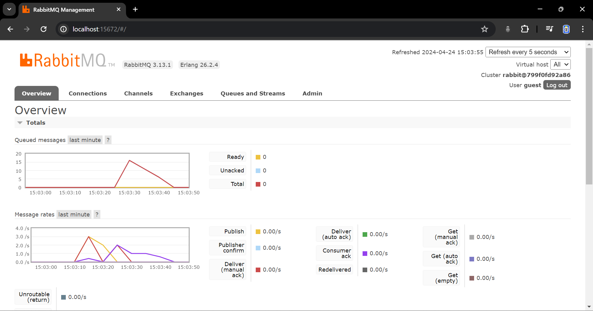

# Question Tutorial 8

## what is amqp?
AMQP (Advanced Message Queuing Protocol) adalah protokol standar untuk pertukaran pesan antar aplikasi.

**Aplikasinya pada kode tutorial**
1. Antrian pesan: 
`user_created` digunakan sebagai nama antrian tempat pesan tentang pembuatan pengguna baru disimpan.

2. Penerima pesan: 
Kode mendefinisikan UserCreatedHandler yang bertindak sebagai penerima pesan.
Ketika pesan baru tiba di antrian `user_created`, UserCreatedHandler dipanggil dan memproses pesan tersebut.
Dalam kode, UserCreatedHandler mencetak isi pesan ke konsol.

**Manfaat AMQP**
1. Asynchronous communication:
Memberikan komunikasi asynchronous antara aplikasi yang menghasilkan pesan (`publisher`) dan aplikasi yang memprosesnya (`subscriber`). Tanpa AMQP, program subscriber tidak akan dapat terhubung ke server message queue dan menerima pesan tentang pembuatan pengguna baru.
2. Decoupling: 
Memisahkan aplikasi yang menghasilkan pesan dari aplikasi yang memprosesnya untuk meningkatkan skalabilitas dan fleksibilitas.
3. Reliability: 
AMQP memastikan pesan terkirim dengan aman sehingga meminimalkan risiko kehilangan data.

## what it means? guest:guest@localhost:5672 , what is the first quest, and what is the second guest, and what is localhost:5672 is for?

`guest:guest@localhost:5672` adalah informasi untuk menghubungkan `subscriber` ke server AMQP.

1. `guest` pertama adalah nama pengguna yang digunakan untuk autentikasi saat menghubungkan ke server AMQP.
2. `guest` kedua adalah kata sandi yang digunakan untuk autentikasi bersama dengan nama pengguna `guest` pertama.
`localhost:5672` adalah alamat (`localhost` mengacu ke mesin lokal tempat program subscriber dijalankan) dan port server AMQP (`5672` adalah port default yang digunakan oleh RabbitMQ untuk koneksi AMQP).

## Simulation slow subscriber

kode `thread::sleep(std::time::Duration::from_millis(10)); pada kode subscriber)` menunjukkan peningkatan panjang antrian. Fenomena ini terjadi karena publisher mengirimkan pesan ke antrian lebih cepat daripada subscriber dapat memprosesnya.

Ketika saya menjalankan cargo run berulang kali (saya melakukan 5x) di direktori publisher, program ini mengirimkan beberapa event "user_created" ke antrian RabbitMQ bernama "user_created" secara cepat.

Namun subscriber menunda 1 detik menggunakan thread::sleep untuk setiap pesan yang diproses.

Karena publisher mengirimkan pesan lebih cepat daripada subscriber dapat memprosesnya dengan penundaan tambahan, pesan mulai menumpuk di antrian. Hal ini tercermin dari peningkatan panjang antrian yang ditampilkan di Antarmuka Manajemen RabbitMQ. Jumlah total pesan dalam antrian (~15 dalam kasus Saya) tergantung pada faktor-faktor jumlah eksekusi publisher.